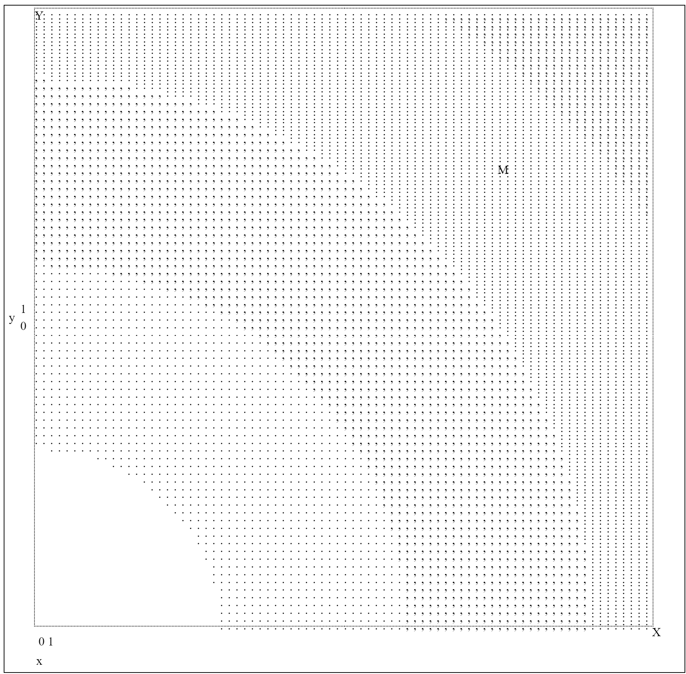
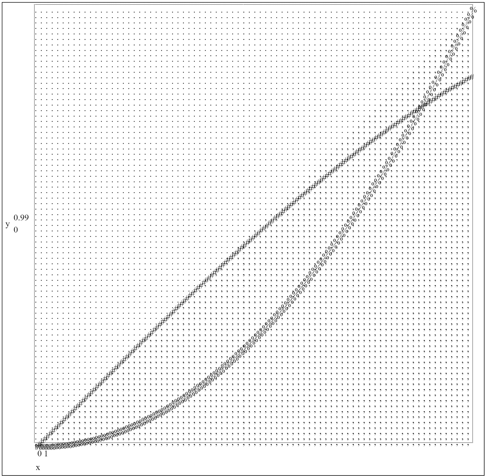
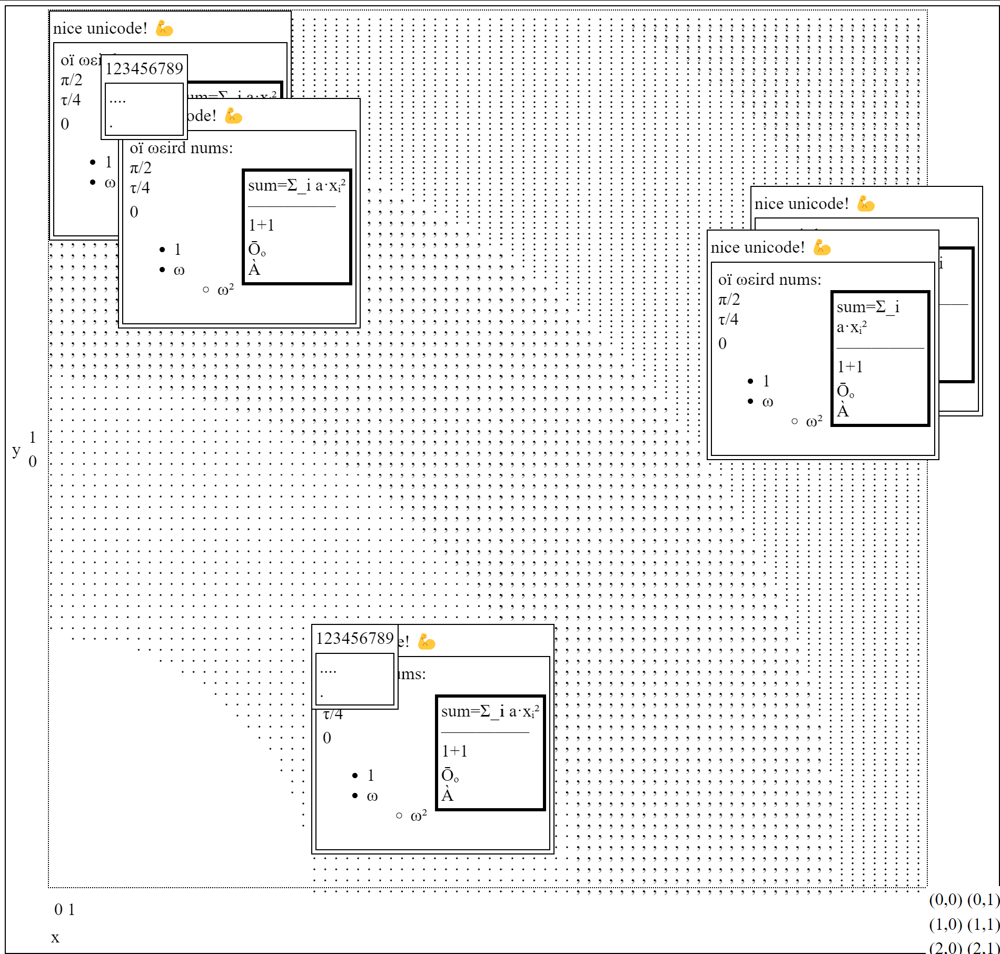
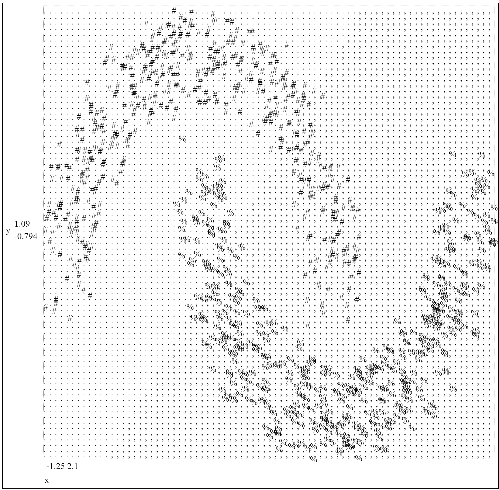

# PrintBox extension for rendering plots over a 2D canvas

See https://ocaml.org/p/printbox-ext-plot/latest/doc/PrintBox_ext_plot/index.html ([source](PrintBox_ext_plot.mli)).

## Example: Map, Scatterbag

[Source.](../../test/plotting.ml)

The `specs` of this graph:

```ocaml
Scatterbag
    { points = [| ((0., 1.), B.line "Y"); ((1., 0.), B.line "X"); ((0.75, 0.75), B.line "M") |] };
Map { callback = (fun (x, y) ->
          let s = ((x ** 2.) +. (y ** 2.)) ** 0.5 in
          B.line @@
          if s < 0.3 then " "
          else if s < 0.6 then "."
          else if s < 0.9 then ","
          else if s < 1.2 then ":"
          else ";"); }
```

Text rendering:

```verbatim
┌──┬────────────────────────────────────────────────────────────────────────────────────────────────────┐
│ 1│Y:::::::::::::::::::::::::::::::::::::::::::::::::::::::::::::::::;;;;;;;;;;;;;;;;;;;;;;;;;;;;;;;;;;│
│  │::::::::::::::::::::::::::::::::::::::::::::::::::::::::::::::::::::::;;;;;;;;;;;;;;;;;;;;;;;;;;;;;;│
│  │:::::::::::::::::::::::::::::::::::::::::::::::::::::::::::::::::::::::::;;;;;;;;;;;;;;;;;;;;;;;;;;;│
│  │::::::::::::::::::::::::::::::::::::::::::::::::::::::::::::::::::::::::::::;;;;;;;;;;;;;;;;;;;;;;;;│
│  │,,,,,,,::::::::::::::::::::::::::::::::::::::::::::::::::::::::::::::::::::::::;;;;;;;;;;;;;;;;;;;;;│
│  │,,,,,,,,,,,,,,,,,,,,,,,:::::::::::::::::::::::::::::::::::::::::::::::::::::::::::;;;;;;;;;;;;;;;;;;│
│  │,,,,,,,,,,,,,,,,,,,,,,,,,,,,,,,::::::::::::::::::::::::::::::::::::::::::::::::::::::;;;;;;;;;;;;;;;│
│  │,,,,,,,,,,,,,,,,,,,,,,,,,,,,,,,,,,,,,::::::::::::::::::::::::::::::::::::::::::::::::::;;;;;;;;;;;;;│
│  │,,,,,,,,,,,,,,,,,,,,,,,,,,,,,,,,,,,,,,,,,,:::::::::::::::::::::::::::::::::::::::::::::::;;;;;;;;;;;│
│  │,,,,,,,,,,,,,,,,,,,,,,,,,,,,,,,,,,,,,,,,,,,,,,,:::::::::::::::::::::::::::::::::::::::::::::;;;;;;;;│
│  │,,,,,,,,,,,,,,,,,,,,,,,,,,,,,,,,,,,,,,,,,,,,,,,,,,,:::::::::::::::::::::::M:::::::::::::::::::;;;;;;│
│  │,,,,,,,,,,,,,,,,,,,,,,,,,,,,,,,,,,,,,,,,,,,,,,,,,,,,,,::::::::::::::::::::::::::::::::::::::::::;;;;│
│  │,,,,,,,,,,,,,,,,,,,,,,,,,,,,,,,,,,,,,,,,,,,,,,,,,,,,,,,,,:::::::::::::::::::::::::::::::::::::::::;;│
│  │,,,,,,,,,,,,,,,,,,,,,,,,,,,,,,,,,,,,,,,,,,,,,,,,,,,,,,,,,,,,:::::::::::::::::::::::::::::::::::::::;│
│  │,,,,,,,,,,,,,,,,,,,,,,,,,,,,,,,,,,,,,,,,,,,,,,,,,,,,,,,,,,,,,,,:::::::::::::::::::::::::::::::::::::│
│  │,,,,,,,,,,,,,,,,,,,,,,,,,,,,,,,,,,,,,,,,,,,,,,,,,,,,,,,,,,,,,,,,,,::::::::::::::::::::::::::::::::::│
│  │...........,,,,,,,,,,,,,,,,,,,,,,,,,,,,,,,,,,,,,,,,,,,,,,,,,,,,,,,,,::::::::::::::::::::::::::::::::│
│  │.....................,,,,,,,,,,,,,,,,,,,,,,,,,,,,,,,,,,,,,,,,,,,,,,,,,::::::::::::::::::::::::::::::│
│  │...........................,,,,,,,,,,,,,,,,,,,,,,,,,,,,,,,,,,,,,,,,,,,,,::::::::::::::::::::::::::::│
│y │...............................,,,,,,,,,,,,,,,,,,,,,,,,,,,,,,,,,,,,,,,,,,,::::::::::::::::::::::::::│
│  │...................................,,,,,,,,,,,,,,,,,,,,,,,,,,,,,,,,,,,,,,,,:::::::::::::::::::::::::│
│  │......................................,,,,,,,,,,,,,,,,,,,,,,,,,,,,,,,,,,,,,,,:::::::::::::::::::::::│
│  │.........................................,,,,,,,,,,,,,,,,,,,,,,,,,,,,,,,,,,,,,::::::::::::::::::::::│
│  │............................................,,,,,,,,,,,,,,,,,,,,,,,,,,,,,,,,,,,,::::::::::::::::::::│
│  │..............................................,,,,,,,,,,,,,,,,,,,,,,,,,,,,,,,,,,,:::::::::::::::::::│
│  │................................................,,,,,,,,,,,,,,,,,,,,,,,,,,,,,,,,,,::::::::::::::::::│
│  │..................................................,,,,,,,,,,,,,,,,,,,,,,,,,,,,,,,,,:::::::::::::::::│
│  │...................................................,,,,,,,,,,,,,,,,,,,,,,,,,,,,,,,,,::::::::::::::::│
│  │           ..........................................,,,,,,,,,,,,,,,,,,,,,,,,,,,,,,,,:::::::::::::::│
│  │                ......................................,,,,,,,,,,,,,,,,,,,,,,,,,,,,,,,,::::::::::::::│
│  │                   ....................................,,,,,,,,,,,,,,,,,,,,,,,,,,,,,,,,:::::::::::::│
│  │                      ..................................,,,,,,,,,,,,,,,,,,,,,,,,,,,,,,,:::::::::::::│
│  │                        .................................,,,,,,,,,,,,,,,,,,,,,,,,,,,,,,,::::::::::::│
│  │                          ................................,,,,,,,,,,,,,,,,,,,,,,,,,,,,,,::::::::::::│
│  │                           ................................,,,,,,,,,,,,,,,,,,,,,,,,,,,,,,:::::::::::│
│  │                            ...............................,,,,,,,,,,,,,,,,,,,,,,,,,,,,,,:::::::::::│
│  │                             ..............................,,,,,,,,,,,,,,,,,,,,,,,,,,,,,,:::::::::::│
│  │                              ..............................,,,,,,,,,,,,,,,,,,,,,,,,,,,,,:::::::::::│
│  │                              ..............................,,,,,,,,,,,,,,,,,,,,,,,,,,,,,,::::::::::│
│ 0│                              ..............................,,,,,,,,,,,,,,,,,,,,,,,,,,,,,,:::::::::X│
├──┼────────────────────────────────────────────────────────────────────────────────────────────────────┤
│  │0                                                                                                  1│
│  │                                                 x                                                  │
└──┴────────────────────────────────────────────────────────────────────────────────────────────────────┘
```

HTML rendering image:


## Example: Line_plot_adaptive, Boundary_map

[Source.](../../test/plotting_linear.ml)

The `specs` of this graph:

```ocaml
Line_plot_adaptive
  { callback = (fun x -> sin x); content = B.line "#"; cache = Hashtbl.create 20 };
Line_plot_adaptive
  { callback = (fun x -> x ** 2.); content = B.line "%"; cache = Hashtbl.create 20 };
Boundary_map
  { content_false = B.line "."; content_true = B.line ","; callback = (fun (x, y) -> x > y) }
```

Text rendering:

```verbatim
┌──┬────────────────────────────────────────────────────────────────────────────────────────────────────┐
│ 1│...................................................................................................%│
│  │.................................................................................................,%,│
│  │..............................................................................................,,,%,,│
│  │............................................................................................,,,,%,,,│
│  │.........................................................................................,,,,,%%,,,,│
│  │.......................................................................................,,,,,,%,,,,,,│
│  │....................................................................................,,,,,,,,%,,,,,,,│
│  │..................................................................................,,,,,,,,%%,,,,####│
│  │...............................................................................,,,,,,,,,,%,#####,,,,│
│  │.............................................................................,,,,,,,,,,####,,,,,,,,,│
│  │..........................................................................,,,,,,,,,,###,,,,,,,,,,,,,│
│  │........................................................................,,,,,,,,####%%,,,,,,,,,,,,,,│
│  │.....................................................................,,,,,,,####,,,%,,,,,,,,,,,,,,,,│
│  │...................................................................,,,,,,###,,,,,%%,,,,,,,,,,,,,,,,,│
│  │................................................................,,,,,####,,,,,,,%,,,,,,,,,,,,,,,,,,,│
│  │.............................................................,,,,,###,,,,,,,,,%%,,,,,,,,,,,,,,,,,,,,│
│  │...........................................................,,,,###,,,,,,,,,,,%,,,,,,,,,,,,,,,,,,,,,,│
│  │........................................................,,,,###,,,,,,,,,,,,%%,,,,,,,,,,,,,,,,,,,,,,,│
│  │......................................................,,,###,,,,,,,,,,,,,%%,,,,,,,,,,,,,,,,,,,,,,,,,│
│y │...................................................,,,###,,,,,,,,,,,,,,%%,,,,,,,,,,,,,,,,,,,,,,,,,,,│
│  │.................................................,,###,,,,,,,,,,,,,,,,%,,,,,,,,,,,,,,,,,,,,,,,,,,,,,│
│  │..............................................,,###,,,,,,,,,,,,,,,,,%%,,,,,,,,,,,,,,,,,,,,,,,,,,,,,,│
│  │............................................,###,,,,,,,,,,,,,,,,,,%%,,,,,,,,,,,,,,,,,,,,,,,,,,,,,,,,│
│  │.........................................,###,,,,,,,,,,,,,,,,,,,%%,,,,,,,,,,,,,,,,,,,,,,,,,,,,,,,,,,│
│  │.......................................,##,,,,,,,,,,,,,,,,,,,,%%,,,,,,,,,,,,,,,,,,,,,,,,,,,,,,,,,,,,│
│  │....................................,###,,,,,,,,,,,,,,,,,,,,%%,,,,,,,,,,,,,,,,,,,,,,,,,,,,,,,,,,,,,,│
│  │..................................###,,,,,,,,,,,,,,,,,,,,,%%,,,,,,,,,,,,,,,,,,,,,,,,,,,,,,,,,,,,,,,,│
│  │...............................###,,,,,,,,,,,,,,,,,,,,,%%%,,,,,,,,,,,,,,,,,,,,,,,,,,,,,,,,,,,,,,,,,,│
│  │............................,##,,,,,,,,,,,,,,,,,,,,,,%%,,,,,,,,,,,,,,,,,,,,,,,,,,,,,,,,,,,,,,,,,,,,,│
│  │..........................###,,,,,,,,,,,,,,,,,,,,,,%%,,,,,,,,,,,,,,,,,,,,,,,,,,,,,,,,,,,,,,,,,,,,,,,│
│  │.......................,##,,,,,,,,,,,,,,,,,,,,,,%%%,,,,,,,,,,,,,,,,,,,,,,,,,,,,,,,,,,,,,,,,,,,,,,,,,│
│  │.....................###,,,,,,,,,,,,,,,,,,,,,%%%,,,,,,,,,,,,,,,,,,,,,,,,,,,,,,,,,,,,,,,,,,,,,,,,,,,,│
│  │..................###,,,,,,,,,,,,,,,,,,,,,%%%,,,,,,,,,,,,,,,,,,,,,,,,,,,,,,,,,,,,,,,,,,,,,,,,,,,,,,,│
│  │................##,,,,,,,,,,,,,,,,,,,,,%%%,,,,,,,,,,,,,,,,,,,,,,,,,,,,,,,,,,,,,,,,,,,,,,,,,,,,,,,,,,│
│  │.............###,,,,,,,,,,,,,,,,,,,,%%%,,,,,,,,,,,,,,,,,,,,,,,,,,,,,,,,,,,,,,,,,,,,,,,,,,,,,,,,,,,,,│
│  │...........##,,,,,,,,,,,,,,,,,,,%%%%,,,,,,,,,,,,,,,,,,,,,,,,,,,,,,,,,,,,,,,,,,,,,,,,,,,,,,,,,,,,,,,,│
│  │........###,,,,,,,,,,,,,,,,,%%%%,,,,,,,,,,,,,,,,,,,,,,,,,,,,,,,,,,,,,,,,,,,,,,,,,,,,,,,,,,,,,,,,,,,,│
│  │......##,,,,,,,,,,,,,,,%%%%%,,,,,,,,,,,,,,,,,,,,,,,,,,,,,,,,,,,,,,,,,,,,,,,,,,,,,,,,,,,,,,,,,,,,,,,,│
│  │...###,,,,,,,,,,%%%%%%%,,,,,,,,,,,,,,,,,,,,,,,,,,,,,,,,,,,,,,,,,,,,,,,,,,,,,,,,,,,,,,,,,,,,,,,,,,,,,│
│ 0│###%%%%%%%%%%%%%,,,,,,,,,,,,,,,,,,,,,,,,,,,,,,,,,,,,,,,,,,,,,,,,,,,,,,,,,,,,,,,,,,,,,,,,,,,,,,,,,,,,│
├──┼────────────────────────────────────────────────────────────────────────────────────────────────────┤
│  │0                                                                                                  1│
│  │                                                 x                                                  │
└──┴────────────────────────────────────────────────────────────────────────────────────────────────────┘
```

HTML rendering image:


### Example: nested boxes

[Source.](../../test/plotting_nested.ml)

The `specs` of this graph:

```ocaml
Scatterbag { points = [| ((0.06, 0.95), reg_45); ((0.3, 0.3), reg_45) |] };
Scatterbag {
    points = [|
        ((0., 1.), nice_unicode);
        ((0.08, 0.9), nice_unicode);
        ((1., 0.), for_3);
        ((0.3, 0.3), nice_unicode);
        ((0.75, 0.75), nice_unicode);
        ((0.8, 0.8), nice_unicode); |]; };
Map {
    callback = (fun (x, y) ->
        let s = ((x ** 2.) +. (y ** 2.)) ** 0.5 in
        B.line
        @@
        if s < 0.3 then " "
        else if s < 0.6 then "."
        else if s < 0.9 then ","
        else if s < 1.2 then ":"
        else ";"); }
```

Text rendering:

```verbatim
┌──┬─────────────────────────────────────────────────────────────────────────────────────────────────────┐
│ 1│┌────────────────────────────────────┐::::::::::::::::::::::::::::;;;;;;;;;;;;;;;;;;;;;;;;;;;;;;;;;; │
│  ││nice unicode! 💪                    │:::::::::::::::::::::::::::::::::;;;;;;;;;;;;;;;;;;;;;;;;;;;;;;│
│  │├────┌─────────┐─────────────────────┤:::::::::::::::::::::::::::::::::::;;;;;;;;;;;;;;;;;;;;;;;;;;; │
│  ││┌───│123456789│┬───────────────────┐│::::::::::::::::::::::::::::::::::::::;;;;;;;;;;;;;;;;;;;;;;;; │
│  │││oï ├─────────┤────────────────────────────┐::::::::::::::::::::::::::::::::::;;;;;;;;;;;;;;;;;;;;; │
│  │││π/2│┌───────┐│code! 💪                    │::::::::::::::::::::::::::::::::::::::;;;;;;;;;;;;;;;;;;│
│  │││τ/4││   ....││────────────────────────────┤::::::::::::::::::::::::::::::::::::::::;;;;;;;;;;;;;;; │
│  ││├───│├───────┤│───────┬───────────────────┐│::::::::::::::::::::::::::::::::::::::::::;;;;;;;;;;;;; │
│  │││   ││.      ││d nums:│┌─────────────────┐││::::::::::::::::::::::::::::::::::┌──────────────────── │
│  │││   │└───────┘│       ││┌───────────────┐│││,,::::::::::::::::::::::::::::::::│nice unicode! 💪     │
│  │││   └─────────┘       │││┌─────────────┐││││,,,,,,:::::::::::::::::::::::┌───────────────────────── │
│  │││   ├─│├──────────────┤│││sum=Σ_i a·xᵢ²│││││,,,,,,,,,::::::::::::::::::::│nice unicode! 💪          │
│  │││   └─││              ││││—————        │││││,,,,,,,,,,,,:::::::::::::::::├───────────────────────── │
│  │││     ││              ││││1+1          │││││,,,,,,,,,,,,,,,::::::::::::::│┌──────────────┬───────── │
│  │││     ││   0          │││├─────────────┤││││,,,,,,,,,,,,,,,,,,:::::::::::││oï ωεird nums:│┌──────── │
│  │││     ││   ├─1        ││││           Ōₒ│││││,,,,,,,,,,,,,,,,,,,,,::::::::││π/2           ││┌─────── │
│  ││└─────││   └─ω        ││││           À │││││,,,,,,,,,,,,,,,,,,,,,,,::::::││τ/4           │││┌────── │
│  │└──────││     └─ω²     │││└─────────────┘││││,,,,,,,,,,,,,,,,,,,,,,,,,::::│├──────────────┤│││sum=Σ_ │
│  │.......││              ││└───────────────┘│││,,,,,,,,,,,,,,,,,,,,,,,,,,,::││              ││││—————  │
│y │.......││              │└─────────────────┘││,,,,,,,,,,,,,,,,,,,,,,,,,,,,,││              ││││1+1    │
│  │.......│└──────────────┴───────────────────┘│,,,,,,,,,,,,,,,,,,,,,,,,,,,,,││   0          │││├────── │
│  │.......└────────────────────────────────────┘,,,,,,,,,,,,,,,,,,,,,,,,,,,,,││   ├─1        ││││       │
│  │.........................................,,,,,,,,,,,,,,,,,,,,,,,,,,,,,,,,,││   └─ω        ││││       │
│  │............................................,,,,,,,,,,,,,,,,,,,,,,,,,,,,,,││     └─ω²     │││└────── │
│  │..............................................,,,,,,,,,,,,,,,,,,,,,,,,,,,,││              ││└─────── │
│  │................................................,,,,,,,,,,,,,,,,,,,,,,,,,,││              │└──────── │
│  │..................................................,,,,,,,,,,,,,,,,,,,,,,,,│└──────────────┴───────── │
│  │...................................................,,,,,,,,,,,,,,,,,,,,,,,└───────────────────────── │
│  │           ..................┌─────────┐──────────────────────────┐,,,,,,,,,,,,,,,,,,::::::::::::::: │
│  │                .............│123456789│de! 💪                    │,,,,,,,,,,,,,,,,,,,,::::::::::::::│
│  │                   ..........├─────────┤──────────────────────────┤,,,,,,,,,,,,,,,,,,,,::::::::::::: │
│  │                      .......│┌───────┐│─────┬───────────────────┐│,,,,,,,,,,,,,,,,,,,,::::::::::::: │
│  │                        .....││   ....││nums:│┌─────────────────┐││,,,,,,,,,,,,,,,,,,,,,:::::::::::: │
│  │                          ...│├───────┤│     ││┌───────────────┐│││,,,,,,,,,,,,,,,,,,,,,:::::::::::: │
│  │                           ..││.      ││     │││┌─────────────┐││││,,,,,,,,,,,,,,,,,,,,,,::::::::::: │
│  │                            .│└───────┘│─────┤│││sum=Σ_i a·xᵢ²│││││,,,,,,,,,,,,,,,,,,,,,,::::::::::: │
│  │                             └─────────┘     ││││—————        │││││,,,,,,,,,,,,,,,,,,,,,,::::::::::: │
│  │                             ││              ││││1+1          │││││,,,,,,,,,,,,,,,,,,,,,,::::::::::: │
│  │                             ││   0          │││├─────────────┤││││,,,,,,,,,,,,,,,,,,,,,,,:::::::::: │
│ 0│                             ││   ├─1        ││││           Ōₒ│││││,,,,,,,,,,,,,,,,,,,,,,,:::::::::( │
├──┼─────────────────────────────────────────────────────────────────────────────────────────────────────┤
│  │0                                                                                                   1│
│  │                                                  x                                                  │
└──┴─────────────────────────────────────────────────────────────────────────────────────────────────────┘
```

HTML rendering image:


## Example: Scatterplot

[Source.](../../test/plotting_nested.ml)

The `specs` of this graph:

```ocaml
Scatterplot { points = points1; content = B.line "#" };
Scatterplot { points = points2; content = B.line "%" };
Boundary_map { content_false = B.line "."; content_true = B.line ",";
               callback = fun (x, y) -> x > y }
```

Text rendering:

```verbatim
┌───────┬────────────────────────────────────────────────────────────────────────────────────────────────────┐
│ 1.09  │............................#.........................................,,,,,,,,,,,,,,,,,,,,,,,,,,,,,,│
│       │.............................##.#...##..##..........................,,,,,,,,,,,,,,,,,,,,,,,,,,,,,,,,│
│       │......................########.###..#.....#.##.....................,,,,,,,,,,,,,,,,,,,,,,,,,,,,,,,,,│
│       │.....................#.#..####.#...#.#..##.#...#.....#...........,,,,,,,,,,,,,,,,,,,,,,,,,,,,,,,,,,,│
│       │..............#....##########.##....####.#...#.##.#.............,,,,,,,,,,,,,,,,,,,,,,,,,,,,,,,,,,,,│
│       │.............#.#####.###.#.#.#.##....###..##.##..##............,,,,,,,,,,,,,,,,,,,,,,,,,,,,,,,,,,,,,│
│       │.................#.#.#####.###...####..#..#.##.#.##.##.......,,,,,,,,,,,,,,,,,,,,,,,,,,,,,,,,,,,,,,,│
│       │.........#....##..##.#..#..####.###......###..##.####.##.##.,,,,,,,,,,,,,,,,,,,,,,,,,,,,,,,,,,,,,,,,│
│       │.........#.....#...###.##.##...#.#.#.#...#.....#.##.#####.,,#,,,,,,,,,,,,,,,,,,,,,,,,,,,,,,,,,,,,,,,│
│       │..........###....#.#####.##.#..........#..#.....#####..###,,,,,,,,,,,,,,,,,,,,,,,,,,,,,,,,,,,,,,,,,,│
│       │.......#..#.#..#.#....#.....#................#..##...#.#,,#,,,,,,,,,,,,,,,,,,,,,,,,,,,,,,,,,,,,,,,,,│
│       │......###.###..##.##..........................#....#..###,#,,,,,,,,,,,,,,,,,,,,,,,,,,,,,,,,,,,,,,,,,│
│       │...#....#.###.##.##..........%.....................##,,#,#,,,,,,,,,,,,,,,,,,,,,,,,,,,,,,,,,,,,,,,,,,│
│       │......#######....#...................%%..........#.,,##,#,###,,,,,,,,,,,,,,,,,,,,,,,,,,,,%,,,,,%,,,,│
│       │.##.##...##.#...##...............%...%............,,,,##,##,###,#,,,,,,,,,,,,,,,,,,,,,,,,,,,,,,,,,,,│
│       │.#.#.#.###.##.##.................%%...%.........,,,,,,,,###,,,##,,#,,,,,,,,,,,,,,,,,,,,,,,,,%%%,%%,,│
│       │.....#.#..##...................%..%%%%%........,,,,,,,,,###,###,#,,,,,,,,,,,,,,,,,,,,,,,%%,,,%%%%,,,│
│       │#.##.###.#.#................%.%...%.%%%......,,,,,,,,,#,,,#,,,,#,,#,,,,,,,,,,,,,,,,,,,,%,,,%,,%,,,,,│
│       │#####.#...##.................%..%.%.....%...,,,,,,,,,,,,,#,,##,###,##,,,,,,,,,,,,,,,,,%%%,,,,%%,%,%,│
│y      │#.#.###.#.##.................%%.%.%%%..%...,,,,,,,,,,,,#,,,,,,,#,#,#,,,,,,,,,,,,,,,,,,%%,%,,,,,,%,%%│
│       │##...###..#..................%%..%..%.%..,,,,,,,,,,,,,,,,##,,####,,,,#,,,,,,,,,,,,,,,%,,%,,,%,%,,%%,│
│       │##......###..........................%%.%,%,,,,,,,,,,,,,,,,,,,,#,####,,,,,,,,,,,,,,,,,,,%%,,,,,%,%%,│
│       │...#.#.###...................%..%%%%..%,,%,,,,,,,,,,,,,,,,##,,#######,,,,,,,,,,,,,,,,%%%,,,,,%,%,,,,│
│       │......##.......................%...%.%%%,,,,,,,,,,,,,,,,,#,#,#,,,,,,#,,,,,,,,,,,,,,,,,,%,,%%,,,%%%,,│
│       │....#..#...........................%,%,,%,,%,,,,,,,,,,,,,,,,#,,,,,,#,,,,,,,,,,,,,,,%,%%%%,,%%,,%,,,,│
│       │........##.......................%,%%,,,%,%,,,,,,,,,,,,,,,,,,,#,,##,,,,,,,,,,,,,,,%%,,,%,,%%%,%,,,,,│
│       │#.#............................%.,%,,%,,%%,,,,%%,,,,,,,,,#,,#,,,,,#,#,,,,,,,,,,,,,,,,%%%,%%,,,,,,,,,│
│       │.#...#.........................,%%%,,%%%%%,%,,,,,,,,,,,,,,,,,#,,,,#,,,,,,,,,,%,,,,,%%%%,%,%,,,%,,,,,│
│       │..............................,,,,,,,%,,%%%,,,%,%%%,%,,,,#,,,,,,,,,,,,,,,,,,,,%,%,,%,%%,%,%%,,%,,,,,│
│       │............................,,,,,,%,%%%%%,%,%,%,%,,,,,,%,,,,,,,,,,,,,,,,,,,,,,%%,,%%,%,%,%,,,,%,,,,,│
│       │...........................,,,,,,,,%,,,%%%%%,%%%,,,,,,,%,,,,,,,,,,,,,,,,%,%%,,%,%%%%%,%%,,,,,,,,,,,,│
│       │.........................,,,,,,,,,,,,,,,,%,,,,,%%%%%,%,%,%%,,,,,,,,,,%,%%%%%%,%,,%,,,,,,,,,,,,,,,,,,│
│       │........................,,,,,,,,,,,,%,,,%,%%,%,,,,,,,%,,%%,,%%,%,,,%%%%%%%,,%,%,%,,,,,%%,,,,,,,,,,,,│
│       │.......................,,,,,,,,,,,,,,,%,,%,%%,%%%,,,,%,%%%,%%,,,%,%%,%,%,%%%,,%%%%%,,,,,,%,,,,,,,,,,│
│       │.....................,,,,,,,,,,,,,,,,,,%%%%,%,,%,,,,,,,%%%,,%,,%%%%,%%,,,%,%,,%%,,%,,,,,,,,,,,,,,,,,│
│       │....................,,,,,,,,,,,,,,,,,,,,,,,,,%,,%%,,%,%,%,%%,%%,,,%,,,%,%%,,,%%%,,,%%%,,,,,,,,,,,,,,│
│       │..................,,,,,,,,,,,,,,,,,,,,,,,,,,,,,,,,%,,%%%,,%%%%,,%%%%,,,%%,%%%%%,,,,,,%,,,,,,,,,,,,,,│
│       │.................,,,,,,,,,,,,,,,,,,,,,,,,,,,,,,,%%%,,,,,,,,%%%%%%,%%,%,,%%,%,,,,%,,,,,,,,,,,,,,,,,,,│
│       │...............,,,,,,,,,,,,,,,,,,,,,,,,,,,,,,,,,,,,%,%%,%%%,%%%,,%%%%,,,%%,,,,,,,,,,,,,,,,,,,,,,,,,,│
│ -0.794│..............,,,,,,,,,,,,,,,,,,,,,,,,,,,,,,,,,,,,,%,,,,,,%,,,,,%,,,%,,,,%%,,,,,,,,,,,,,,,,,,,,,,,,,│
├───────┼────────────────────────────────────────────────────────────────────────────────────────────────────┤
│       │-1.25                                                                                            2.1│
│       │                                                 x                                                  │
└───────┴────────────────────────────────────────────────────────────────────────────────────────────────────┘
```

HTML rendering image:

